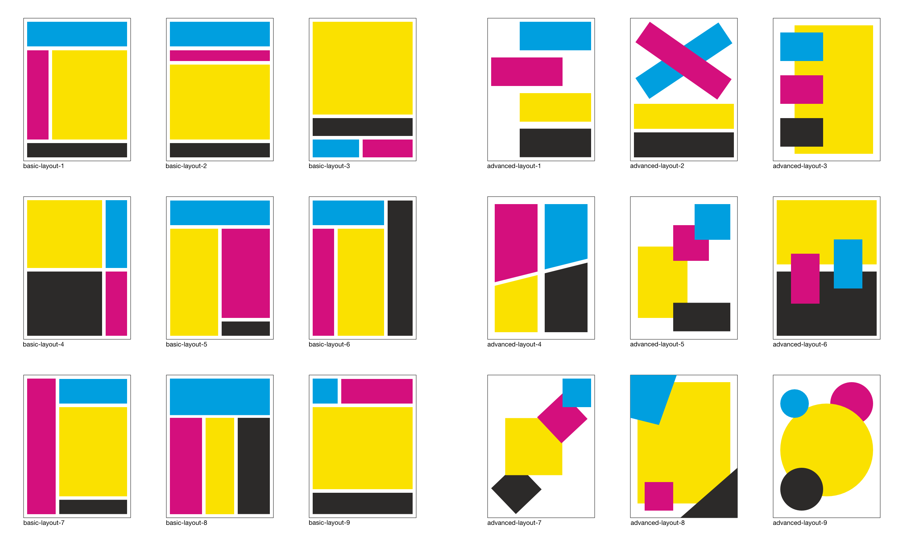

# The Client - Layout in CSS

Een oefening in document layout met CSS.

## Context

Deze leertaak hoort bij sprint 2 the client. Dit is een deeltaak die je individueel uitvoert en waarmee je een checkpoint bij je docent haalt.

In het college [[collegenaam](link)] wordt behandeld ... 

## Doel van deze opdracht

In onderstaande afbeelding zien je 18 verschillende layouts welke je met CSS kunt maken. Negen daarvan zijn basic layouts welke je met grid-template-areas en grid-area goed kunt realiseren. Naast deze basic layouts zijn er ook negen advanced layouts waarvoor je iets meer trucage uit je mouw moet schudden. 

Waarom zou je dit doen? Omdat je oefent met veel verschillende layouts met de vier basis document elementen. Na het succesvol implementeren van alle bovenstaande layouts heb je altijd een soort *spiekbriefje* om naar terug te kijken als je een layout maakt.

## Werkwijze

Deze opdracht gaat over alle fases van de DLC: [analyseren](#analyseren), [ontwerpen](#ontwerpen), [bouwen](#bouwen), [integreren](#integreren) en [testen](#testen).

### Analyseren
Uitleg..

#### Aanpak

1. ...
2. ...

#### Materiaal 

- [bron]
- [bron]

### Ontwerpen
Uitleg..

#### Aanpak

1. ...
2. ...

#### Materiaal 

- [bron]
- [bron]

### Bouwen
Uitleg..

#### Aanpak

1. ...
2. ...

#### Materiaal 

- [bron]
- [bron]

### Integreren
Uitleg..

#### Aanpak

1. ...
2. ...

#### Materiaal 

- [bron]
- [bron]
- 
### Testen
Uitleg..

#### Aanpak

1. ...
2. ...

#### Materiaal 

- [bron]
- [bron]

## Criteria

Focus sprint # - De focus van deze sprint ligt op ...

Deze deeltaak hoort bij het gedragscriterium:  
...

Deze opdracht is done als:

- [ ] ...
- [ ] ...
- [ ] ...

